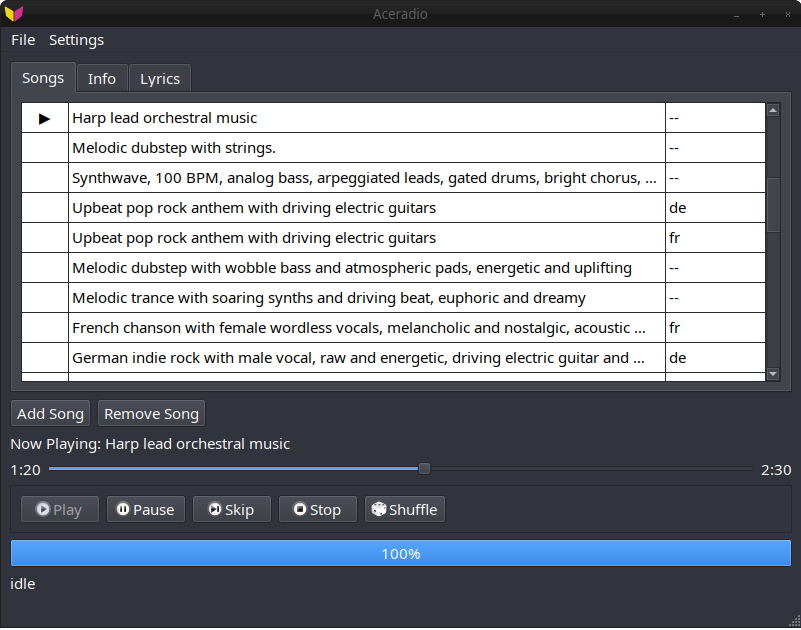

# Aceradio



A C++ Qt graphical user interface for generating music using acestep.cpp.

## Requirements

- Qt 6 Core, Gui, Widgets, and Multimedia
- CMake 3.14+
- acestep.cpp (bring your own binaries)

## Building

### Build acestep.cpp first:

```bash
git clone https://github.com/ServeurpersoCom/acestep.cpp.git
cd acestep.cpp
mkdir build && cd build
cmake .. -DGGML_VULKAN=ON  # or other backend
make -j$(nproc)
./models.sh  # Download models (requires ~7.7 GB free space)
```

### Build the GUI:

```bash
git clone git@github.com:IMbackK/aceradio.git
cd aceradio
mkdir build && cd build
cmake ..
make -j$(nproc)
```

### Setup Paths:

Go to settings->Ace Step->Model Paths and add the paths to the acestep.cpp binaries the models.
